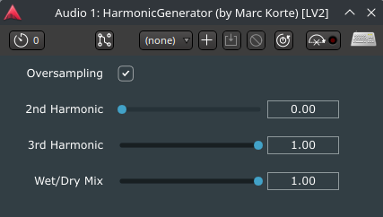

# HarmonicGeneratorPlugin
A JUCE-based audio plugin for generating subtle 2nd and 3rd order harmonics.



## Download
Download compiled plugins (VST3, LV2) from the [Releases page](https://github.com/luna-co-software/HarmonicGeneratorPlugin/releases). These are for Linux only at the moment. I will try to compile for Mac and Windows when I have time.

## Installation
- **VST3**: Copy `HarmonicGenerator.vst3` to `~/.lv2` (Linux) 
- **LV2**: Copy `HarmonicGenerator.lv2` to `~/.vst3` (Linux).

## Building from Source
Requires JUCE (install it at `~/JUCE` or adjust the path) and CMake. Run the following commands from the `build` directory:

```bash
cmake .. -DJUCE_PATH=~/JUCE
cmake --build . --config Release
